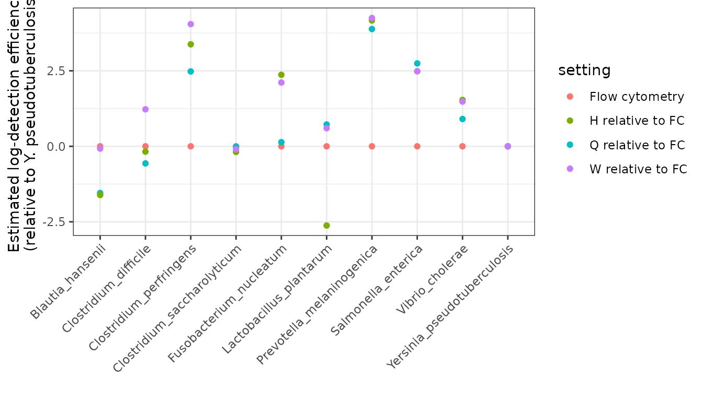

# Comparing detection efficiencies across experiments

## Scope and purpose

In this vignette, we will walk through how to use `tinyvamp` to estimate
and compare detection efficiencies across batches or experiments. We
will consider the Phase 2 data of Costea et al. (2017), who spiked-in a
10-member synthetic community to 10 samples, which were then sequenced
using three shotgun metagenomic sequencing experimental protocols
(protocols H, Q and W). Abundances were also measured using flow
cytometry.

Specifically, we will demonstrate how to fit the following model:
$$\begin{array}{r}
{{{\text{expected counts for taxon}\mspace{6mu}}j{\mspace{6mu}\text{in sample}\mspace{6mu}}i} = p_{ij}e^{\gamma_{i} + \beta_{1j}\mathbf{1}_{\{{i{\mspace{6mu}\text{from sequencing}}}\}} + \beta_{2j}\mathbf{1}_{\{{i{\mspace{6mu}\text{from seq. method Q}}}\}} + \beta_{3j}\mathbf{1}_{\{{i{\mspace{6mu}\text{from seq. method W}}}\}}}}
\end{array}$$ where

- $p_{ij}$ is the unknown relative abundance of taxon $j$ in sample $i$.
  We constrain $\mathbf{p}_{i} = \mathbf{p} \in {\mathbb{S}}^{10 - 1}$
  for all $i$, where $\mathbf{p}$ is the composition of the 10-taxa
  synthetic community spiked into all samples.
- $\mathbf{β}$ reflects differential detection between the four
  measurement approaches. ${\mathbf{β}} \in {\mathbb{R}}^{3 \times 10}$
  are unknown, with the exception of
  ${\mathbf{β}}_{\cdot 10} = \mathbf{0}_{3}$ for identifiability. Under
  this model, $\text{exp}\left( \beta_{1j} \right)$,
  $\text{exp}\left( \beta_{1j} + \beta_{2j} \right)$, and
  $\text{exp}\left( \beta_{1j} + \beta_{3j} \right)$ give the degree of
  over- or under-detection of taxon $j$ relative to taxon 10 under
  protocols H, Q, and W, respectively, using flow cytometry as the
  reference protocol.

In addition to estimating $\mathbf{p}$ and $\mathbf{β}$, we will also
test the null hypothesis that detection efficiencies of the three
shotgun protocols are the same ($H_{0}:\beta_{qj} = 0$ for $q = 2,3$ and
all $j$).

Because of its flexibility, fitting a model using `tinyvamp` involves
specifying a lot of parameters. The focus of this vignette will
therefore be on *how* we set up the model to estimate detection
efficiencies, rather than *why* we set up the model in this way. Please
see the tinyvamp paper and references therein for those details!

## Comparing detection efficiencies across experiments

### Setup

We will start by loading the relevant packages.

``` r
library(tidyverse)
library(tinyvamp)
library(dplyr)
library(ggplot2)
filter <- dplyr::filter
```

Now let’s load the relevant data and inspect it. This dataset contains
the MetaPhlAn2-estimated relative abundances of taxa in 29 samples,
formatted in the usual MetaPhlAn2 way (percentages listed at all
taxonomic levels):

``` r
data("costea2017_metaphlan2_profiles")
```

Since we are going to compare relative detections of the taxa in the
synthetic community that was spiked into all samples, we will start by
filtering to only the species in the spiked-in community (10 taxa). To
do this, let’s grab the composition data and save the column of species
names:

``` r
data("costea2017_mock_composition")
mock_taxa <- costea2017_mock_composition$Taxon
```

Now, we can tidy the MetaPhlAn2 data and pull out the rows for our
spike-in species:

``` r
costea2017_metaphlan2_profiles_species <- costea2017_metaphlan2_profiles %>% 
  filter(!str_detect(Clade, "t__")) %>% 
  filter(str_detect(Clade, paste(mock_taxa, collapse="|"))) %>% 
  mutate(Clade = str_remove(Clade, ".*s__"))
```

We can now see our final relative abundance table as follows:

``` r
costea2017_metaphlan2_profiles_species
#> # A tibble: 10 × 30
#>    Clade       ERR1971003 ERR1971004 ERR1971005 ERR1971006 ERR1971007 ERR1971008
#>    <chr>            <dbl>      <dbl>      <dbl>      <dbl>      <dbl>      <dbl>
#>  1 Prevotella…    0.837       7.64       6.98      3.14       5.63       0.461  
#>  2 Lactobacil…    0.0944      0.942      0.587     0.655      0.500      0.300  
#>  3 Clostridiu…    0.274       1.47       1.69      0.463      1.81       0.261  
#>  4 Clostridiu…    0.115       0.684      0.441     0.318      0.437      0.117  
#>  5 Blautia_ha…    0.00149     0.0136     0.0117    0.0111     0.00713    0.00315
#>  6 Clostridiu…    0.0325      0.155      0.206     0.0886     0.189      0.0271 
#>  7 Fusobacter…    0.00941     0.0352     0.0822    0.00765    0.0614     0.00724
#>  8 Salmonella…    1.22        6.12       4.20      2.88       3.46       1.77   
#>  9 Yersinia_p…    0.0349      0.266      0.203     0.137      0.141      0.0447 
#> 10 Vibrio_cho…    0.106       0.713      0.452     0.309      0.323      0.0919 
#> # ℹ 23 more variables: ERR1971009 <dbl>, ERR1971010 <dbl>, ERR1971011 <dbl>,
#> #   ERR1971012 <dbl>, ERR1971013 <dbl>, ERR1971014 <dbl>, ERR1971015 <dbl>,
#> #   ERR1971016 <dbl>, ERR1971017 <dbl>, ERR1971018 <dbl>, ERR1971019 <dbl>,
#> #   ERR1971020 <dbl>, ERR1971021 <dbl>, ERR1971022 <dbl>, ERR1971023 <dbl>,
#> #   ERR1971024 <dbl>, ERR1971025 <dbl>, ERR1971026 <dbl>, ERR1971027 <dbl>,
#> #   ERR1971028 <dbl>, ERR1971029 <dbl>, ERR1971030 <dbl>, ERR1971031 <dbl>
```

## Construct observation matrix W

We now need to grab the flow cytometry data and combine it with our
sequencing data. Since two observations were taken on all taxa except
*Vibrio cholerae*, let’s start by averaging the flow cytometry
measurements, then combining this data with the relative abundance data:

``` r
species_by_sample <- costea2017_mock_composition %>% 
  rename(cells_per_ml = 2) %>%
  group_by(Taxon) %>%
  summarize(cells_per_ml = mean(cells_per_ml)) %>%
  inner_join(costea2017_metaphlan2_profiles_species, by = c("Taxon" = "Clade"))
```

We can then finally arrange our data into the $n \times J$ matrix
$\mathbf{W}$ that we will be modeling with `tinyvamp`:

``` r
W <- species_by_sample %>% 
  select(-Taxon) %>% 
  as.matrix %>% 
  t
colnames(W) <- species_by_sample$Taxon
```

Because it’s a matrix, printing `W` will display the full observation
matrix. Feel free to check it out in an interactive environment!

## Specify sample-by-specimen and other design matrices

To fit `tinyvamp`, we need to specify the detection design matrix
$\mathbf{X}$, which tells the software which samples were sequenced with
which protocols. To do that, let’s load the sample data and join it to
our abundance data (this makes sure we don’t mix up the order of the
rows across datasets):

``` r
data("costea2017_sample_data")
protocol_df <- W %>% 
  as_tibble(rownames="Run_accession") %>%
  full_join(costea2017_sample_data) %>% 
  select(Run_accession, Protocol)
#> Joining with `by = join_by(Run_accession)`
protocol_df
#> # A tibble: 30 × 2
#>    Run_accession Protocol
#>    <chr>         <chr>   
#>  1 cells_per_ml  NA      
#>  2 ERR1971003    Q       
#>  3 ERR1971004    Q       
#>  4 ERR1971005    Q       
#>  5 ERR1971006    Q       
#>  6 ERR1971007    Q       
#>  7 ERR1971008    Q       
#>  8 ERR1971009    Q       
#>  9 ERR1971010    Q       
#> 10 ERR1971011    Q       
#> # ℹ 20 more rows
```

There are lots of different ways we could set up our comparisons between
protocols. For example, we *could* estimate detection efficiencies with
respect to the flow cytometry measurements. That is, we could estimate
detection effects for protocol H vs flow cytometry; protocol Q vs flow
cytometry; protocol W vs flow cytometry (of course, we would get a
different estimate of the detection effects for each taxon). That would
correspond to this model:

$$\begin{array}{r}
{{{\text{expected counts for taxon}\mspace{6mu}}j{\mspace{6mu}\text{in sample}\mspace{6mu}}i} = p_{ij}e^{\gamma_{i} + \beta_{1j}\mathbf{1}_{\{{i{\mspace{6mu}\text{from seq. method H}}}\}} + \beta_{2j}\mathbf{1}_{\{{i{\mspace{6mu}\text{from seq. method Q}}}\}} + \beta_{3j}\mathbf{1}_{\{{i{\mspace{6mu}\text{from seq. method W}}}\}}}}
\end{array}$$

Here’s how we would create that matrix:

``` r
X <- protocol_df %>%
  mutate(hh = ifelse(Protocol == "H" & !is.na(Protocol), 1, 0),
         qq = ifelse(Protocol == "Q" & !is.na(Protocol), 1, 0),
         ww = ifelse(Protocol == "W" & !is.na(Protocol), 1, 0)) %>% 
  select(hh, qq, ww) %>%
  as.matrix()   # convert to numeric matrix required by tinyvamp
```

However, we are interested in assessing the evidence against detection
efficiencies being the same between protocols H, Q and W. To make our
lives easy for testing this hypothesis later, we’re going to estimate
the model slightly differently: we’re going to create a “intercept”
variable as well as a protocol Q variable and a protocol W variable. The
intercept variable equals 1 for all sequencing protocols, and the Q
variable equals 1 for only samples sequenced with the protocol Q and
zero for all other samples. You could also think of the intercept as an
indicator for “this sample was sequenced”. This is exactly the model we
described at the beginning of this vignette:

$$\begin{array}{r}
{{{\text{expected counts for taxon}\mspace{6mu}}j{\mspace{6mu}\text{in sample}\mspace{6mu}}i} = p_{ij}e^{\gamma_{i} + \beta_{1j}\mathbf{1}_{\{{i{\mspace{6mu}\text{from sequencing}}}\}} + \beta_{2j}\mathbf{1}_{\{{i{\mspace{6mu}\text{from seq. method Q}}}\}} + \beta_{3j}\mathbf{1}_{\{{i{\mspace{6mu}\text{from seq. method W}}}\}}}}
\end{array}$$

Here’s how we create that matrix:

``` r
X <- protocol_df %>%
  mutate(intercept = ifelse(!is.na(Protocol), 1, 0),
         qq = ifelse(Protocol == "Q" & !is.na(Protocol), 1, 0),
         ww = ifelse(Protocol == "W" & !is.na(Protocol), 1, 0)) %>% 
  select(intercept, qq, ww) %>%
  as.matrix
```

By parameterizing the model this way, we can test whether detection
efficiencies being the same between protocols H, Q and W by testing the
hypothesis $\beta_{Q \cdot} = \beta_{W \cdot} = \mathbf{0}$. (This may
be clarified below – so if you’re confused, dear reader, read on!)

Since $\mathbf{X}$ and $\mathbf{β}$ go together in the model, lets also
initialize our estimate of $\mathbf{β}$, and tell the model what we know
about $\mathbf{β}$. Let initialize the estimation algorithm at “all taxa
have the same detection efficiencies under all protocols”:

``` r
J <- ncol(W) ## here, 10
B <- matrix(0, ncol = J, nrow = 3)
```

(Remember that there are 10 taxa and 3 protocol variables: Intercept,
Protocol Q and Protocol W)

What do we know about $\mathbf{β}$? Nothing, right? Well, almost. We
always need to choose which taxon we’re comparing our efficiencies
against. Let’s choose the last taxon, *Yersinia pseudotuberculosis*.

``` r
B_fixed_indices <- matrix(FALSE, ncol = J, nrow = 3)
B_fixed_indices[, J] <- TRUE
```

Under this parametrization and constraints, we interpret

- $exp\left( \beta_{1j} \right)$ as the degree of multiplicative
  overdetection of taxon $j$ relative to *Yersinia pseudotuberculosis*
  in protocol H compared to flow cytometry
- $exp\left( \beta_{2j} \right)$ as the degree of multiplicative
  overdetection of taxon $j$ relative to *Yersinia pseudotuberculosis*
  in protocol Q compared to protocol H
- $exp\left( \beta_{3j} \right)$ as the degree of multiplicative
  overdetection of taxon $j$ relative to *Yersinia pseudotuberculosis*
  in protocol W compared to protocol H.

Now let’s move on to set up the sample design matrix, which links
samples to specimens. $\mathbf{Z}$ is a $n \times K$ matrix, where $n$
is the number of samples and $K$ is the number of specimens. Here, there
is only one specimen – the synthetic community that was spiked-in to
every sample. So here’s our $\mathbf{Z}$:

``` r
nn <- nrow(W)
Z <- matrix(1, nrow = nn, ncol = 1)
```

We now need to initialize our relative abundance matrix $\mathbf{p}$, a
$K \times J$. Let’s initialize it at the sample relative abundance from
the flow cytometry data, and tell the algorithm that we don’t know any
of the entries of $\mathbf{p}$.

``` r
P <- matrix(W[1,]/sum(W[1,]), nrow = 1, ncol = J)
P_fixed_indices <- matrix(FALSE, nrow = 1, ncol = J)
```

Let’s tell `tinyvamp` that we don’t know the sample intensities
$\mathbf{γ}$, and initialize them at the log-total number of reads
across all taxa:

``` r
gammas <- apply(W,1,function(x) log(sum(x)))
gammas_fixed_indices <- rep(FALSE, length(gammas))
```

Almost done! We’re not going to try to estimate any contamination in
this model – so $\widetilde{\mathbf{Z}} = 0$,
$\widetilde{\mathbf{X}} = 0$, $\widetilde{\gamma}$ could be anything (we
set it to zero), and we tell it “don’t estimate
$\widetilde{\mathbf{p}}$”, like so:

``` r
Z_tilde <- matrix(0, nrow= 30, ncol = 1)
Z_tilde_gamma_cols <- 1
gamma_tilde <- matrix(0,ncol = 1, nrow = 1)
gamma_tilde_fixed_indices <- TRUE
P_tilde <- matrix(0,nrow =1, ncol = 10)
P_tilde_fixed_indices <- matrix(TRUE,nrow = 1, ncol = 10)
X_tilde <- matrix(0, ncol = 3, nrow= 1)
```

## Fitting the model

Woohoo! It’s time to fit the model.

``` r
full_model <- estimate_parameters(W = W,
                                  X = X,
                                  Z = Z,
                                  Z_tilde = Z_tilde,
                                  Z_tilde_gamma_cols = Z_tilde_gamma_cols,
                                  gammas = gammas,
                                  gammas_fixed_indices = gammas_fixed_indices,
                                  P = P,
                                  P_fixed_indices = P_fixed_indices,
                                  B = B,
                                  B_fixed_indices = B_fixed_indices,
                                  X_tilde = X_tilde,
                                  P_tilde = P_tilde,
                                  P_tilde_fixed_indices = P_tilde_fixed_indices,
                                  gamma_tilde = gamma_tilde,
                                  gamma_tilde_fixed_indices = gamma_tilde_fixed_indices,
                                  alpha_tilde = NULL,
                                  Z_tilde_list = NULL)
full_model$optimization_status
#> [1] "Converged"
```

Woohoo, done! The model converges quickly (\<1 second on my 8 y.o.
computer) despite the relatively large number of parameters (67). For
this analysis we just use the default optimization settings, but you can
play around with them and learn more through
[`?estimate_parameters`](https://statdivlab.github.io/tinyvamp/reference/estimate_parameters.md)

`full_model` is a list that contains a bunch of information. You can
what’s in there with `full_model %>% names`. Let’s dive right in and
check out some of the estimates:

``` r
full_model$varying %>% as_tibble
#> # A tibble: 67 × 4
#>     value param     k     j
#>     <dbl> <chr> <dbl> <dbl>
#>  1 0.0343 P         1     1
#>  2 0.106  P         1     2
#>  3 0.0553 P         1     3
#>  4 0.228  P         1     4
#>  5 0.0155 P         1     5
#>  6 0.168  P         1     6
#>  7 0.0688 P         1     7
#>  8 0.147  P         1     8
#>  9 0.0773 P         1     9
#> 10 0.0992 P         1    10
#> # ℹ 57 more rows
```

Let’s visually compare the sequencing protocols with respect to flow
cytometry. We have to be a bit careful here to think about our
parametrization: remember that $\text{exp}\left( \beta_{1j} \right)$,
$\text{exp}\left( \beta_{1j} + \beta_{2j} \right)$, and
$\text{exp}\left( \beta_{1j} + \beta_{3j} \right)$ give the degree of
over- or under-detection of taxon $j$ relative to taxon 10 under
protocols H, Q, and W, respectively, using flow cytometry as the
reference protocol. That is, to compare to flow cytometry, we want to
look at $\beta_{1j} + \beta_{2j}$, not just $\beta_{2j}$. Let’s set that
up:

``` r
the_settings <- X %>% as_tibble %>% dplyr::distinct()
fitted_detectabilities <- (X %*% full_model$B) %>% as_tibble %>% dplyr::distinct()
#> Warning: The `x` argument of `as_tibble.matrix()` must have unique column names if
#> `.name_repair` is omitted as of tibble 2.0.0.
#> ℹ Using compatibility `.name_repair`.
#> This warning is displayed once per session.
#> Call `lifecycle::last_lifecycle_warnings()` to see where this warning was
#> generated.
colnames(fitted_detectabilities) <- colnames(W)
the_betahats <- the_settings %>% 
  mutate("setting" = ifelse(intercept == 0, "Flow cytometry",
                            ifelse(qq == 0 & ww == 0, "H relative to FC",
                                   ifelse(qq == 1 & ww == 0, "Q relative to FC",
                                          "W relative to FC"))), .before = 1) %>% 
  bind_cols(fitted_detectabilities) %>% 
  select(-intercept, -qq, -ww) %>% 
  pivot_longer(-setting)
the_betahats
#> # A tibble: 40 × 3
#>    setting        name                        value
#>    <chr>          <chr>                       <dbl>
#>  1 Flow cytometry Blautia_hansenii                0
#>  2 Flow cytometry Clostridium_difficile           0
#>  3 Flow cytometry Clostridium_perfringens         0
#>  4 Flow cytometry Clostridium_saccharolyticum     0
#>  5 Flow cytometry Fusobacterium_nucleatum         0
#>  6 Flow cytometry Lactobacillus_plantarum         0
#>  7 Flow cytometry Prevotella_melaninogenica       0
#>  8 Flow cytometry Salmonella_enterica             0
#>  9 Flow cytometry Vibrio_cholerae                 0
#> 10 Flow cytometry Yersinia_pseudotuberculosis     0
#> # ℹ 30 more rows
the_betahats %>% 
  ggplot(aes(x = name, y = value, color = setting)) +
  geom_point() +
  labs(
    y = "Estimated log-detection efficiency\n(relative to Y. pseudotuberculosis)",
    x = "",
  ) + 
  theme_bw() + 
  theme(axis.text.x = element_text(angle = 45, vjust = 1, hjust=1))
```



## Testing the hypothesis of equal detectability

Testing whether detection efficiencies are identical across protocols H,
Q, and W corresponds to the hypothesis $\beta_{Q,j} = \beta_{W,j} = 0$
for all $j = 1,\ldots,J - 1$. In other words, protocols Q and W don’t
differ from protocol H in their detectabilities, where the
detectabilities are relative to flow cytometry.

To test this hypothesis, we need to tell tinyvamp what the null
hypothesis is. We do this as follows:

``` r
### Create null model specification for test
null_param <- full_model
### set second and third rows of B equal to zero
null_param$B[2:3,] <- 0
null_param$B_fixed_indices[2:3,] <- TRUE
```

We then refit the model under the null to obtain the sampling
distribution of the test statistics under the null, and compare the
observed test statistics to this null distribution. The wall time of
this step is proportional to `n_boot`, but can be parallelized across
your computer’s cores using the package `parallel`. Using only one core,
10 bootstrap iterations took less than 35 seconds on my 1.4 GHz
Dual-Core Intel Core i7 from 2017. So, on a more modern machine using
parallelization, even 100 iterations should take even less than a
minute. Take this minute to stretch your neck and hands, or look at a
photo of your favourite cat.

``` r
bootstrap_test <-  
  bootstrap_lrt(W = W,
                fitted_model= full_model,
                null_param = null_param,
                n_boot = 500, # do 1000 for a paper, 100 for a first look
                ncores = 5,
                parallelize = TRUE)
```

You can obtain the p-value for this test via `bootstrap_test$boot_pval`.
Here, it’s definitely rejected – not one bootstrapped test statistic
under the null came close to our observed test statistic.

Ok! That’s it for estimation and testing of detectabilities. Let us know
your questions, and thanks for using `tinyvamp`!

### References

- Costea, P., Zeller, G., Sunagawa, S. et al. Towards standards for
  human fecal sample processing in metagenomic studies. *Nat Biotechnol*
  **35**, 1069–1076 (2017). <https://doi.org/10.1038/nbt.3960>.
- Clausen, D.S. and Willis, A.D. Modeling complex measurement error in
  microbiome experiments. *arxiv* 2204.12733.
  <https://arxiv.org/abs/2204.12733>.
